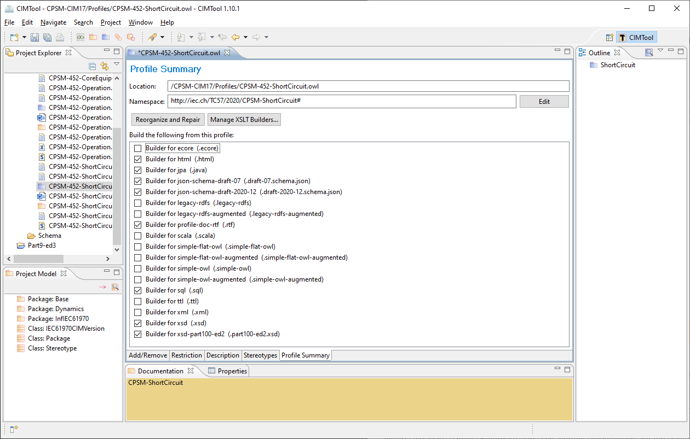
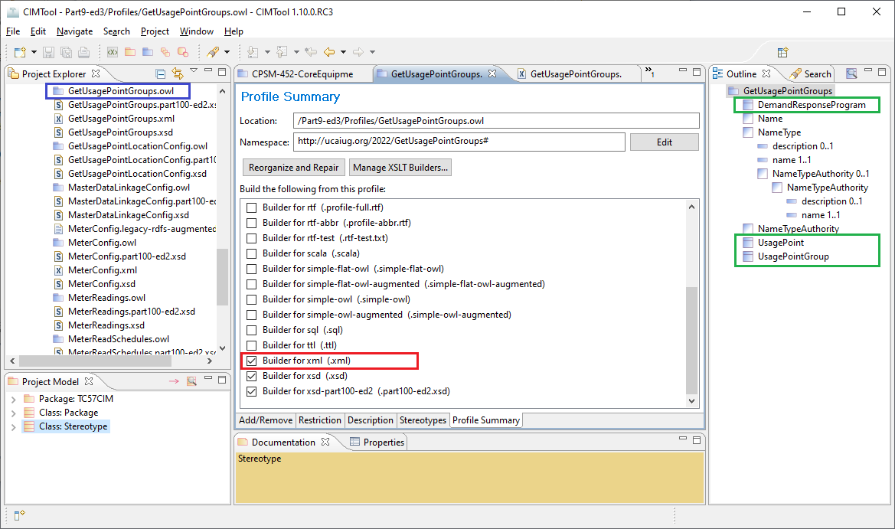

# CIMTool-XSLT-Builders

This is the official UCAIug repository for custom **CIMTool** XSLT transform builders and is provided as a public space to create, collaborate and contribute back builders for the benefit of the CIMTool community at large.  This library of builders can be used in **CIMTool** to generate various types of target artifacts from a CIMTool profile definition.  

Would you like a custom builder that generates C/C++ objects from your CIMTool profiles? Perhaps you've wished there was a builder to create [Apache Avro](https://avro.apache.org/) schemas for data serialization or one that would automatically generate a [Google Protocol Buffers](https://developers.google.com/protocol-buffers/docs/overview) ```.proto``` file?  You can now with **CIMTool**'s custom builder import feature.

Included in this library is the base set of XSLT transforms that comes shipped with **CIMTool**. These have been included to serve as examples or starting points that can be either extended or used as working examples when creating new XSLT transforms.

Feel free to initiate a [discussion](https://github.com/CIMug-org/CIMTool-XSLT-Builders/discussions) around a new idea for a custom builder or to post a question on the discussions board. Please contribute new builders to this library using the submission process outlined later.

## Current Library of Builders


#### Builders Shipped with CIMtool:

| XSLT Builder | Output Type | Description |
|------------------|------------------|------------------|
| [xsd.xsl](shipped-builders/xsd/builder.md) | XSD schema | The **xsd.xsl** builder generates an XSD schema that is compliant with the **IEC 62361-100:2016** (CIM Profiles to XML Schema Mapping) standard. Additionally, the schemas are compatible with the **IEC 61968-100:2013 [Ed 1.0]** (Implementation Profiles) standard used for enterprise integration.|
| [xsd-part100-ed2.xsl](shipped-builders/xsd-part100-ed2/builder.md) | XSD schema | This builder is similar to the xsd.xsl builder above in that it also generates an XSD schema that is compliant with **IEC 62361-100:2016**.  However, these generated schemas are uniquely compatible with the new **IEC 61968-100:2022 [Ed 2.0]** published standard which is not backwards compatible with Edition 1.0. |
| [jpa.xsl](shipped-builders/jpa/builder.md) | Java source file | The **jpa.xsl** builder generates a Java source file (```*.java```) containing JPA classes compatible with JPA 2.2 and earlier. The defined JPA classes can be utilized in Java applications for persisting profiles to a database. |
| [scala.xsl](shipped-builders/scala/builder.md) | Scala source file | The **scala.xsl** builder produces a Scala source file (```*.scala```) that defines a vocabulary for a profile definition. These source files contain Scala classes/objects representative of those in the profile and may be used in applications implemented in the Scala programming language. |
| [sql.xsl](shipped-builders/sql/builder.md) | SQL DDL file | The **sql.xsl** builder generates an ANSI SQL-compliant DDL (Data Definition Language) script (```*.sql```) that can be used to create the database tables and fields corresponding to the classes and attributes represented in a profile. |
| [profile-doc-rtf.xsl](shipped-builders/profile-doc-rtf/builder.md) | Microsoft Word file | The **profile-doc-rtf.xsl** builder produces a Microsoft Word compatible RTF (Rich Text Format) document that contains the complete documentation for all classes, attributes and associations defined in a profile. |
| [html.xsl](shipped-builders/html/builder.md) | HTML file | The **html.xsl** builder generates a standalone HTML file containing the complete documentation for all classes, attributes and associations defined in a profile. |
| [json-schema-draft-07.xsl](shipped-builders/json-schema-draft-07/builder.md) | JSON schema | The **json-schema-draft-07.xsl** builder generates a JSON schema compliant with the draft **IEC 62361-104** standard (CIM Profiles to JSON schema Mapping). The version of the JSON schema specification that the schema conforms to is draft-07. |
| [json-schema-draft-2020-12.xsl](shipped-builders/json-schema-draft-2020-12/builder.md) | JSON schema | The **json-schema-draft-2020-12.xsl** builder generates a JSON schema compliant with the draft **IEC 62361-104** standard (CIM Profiles to JSON schema Mapping). The version of the JSON schema specification that the schema conforms to is draft-2020-12. |

#### Community Developed Builders:

| XSLT Builder | Output Type | Description |
|------------------|------------------|------------------|
| [json-schema-draft-07-jsonschema2pojo.xsl](custom-builders/json-schema-draft-07-jsonschema2pojo/builder.md) | Specialized JSON schema |  The **json-schema-draft-07-jsonschema2pojo.xsl** builder produces a specialized JSON schema to be used as input into the jsonschema2pojo open source Maven or Gradle build plugins to generate annotated Java classes for data-binding with Jackson 2.x or Gson. This custom builder was derived from the **json-schema-draft-07.xsl** builder and is intended to serve as a companion builder to it. |
| [json-schema-draft-2020-12-jsonschema2pojo.xsl](custom-builders/json-schema-draft-2020-12-jsonschema2pojo/builder.md) | Specialized JSON schema | The **json-schema-draft-2020-12-jsonschema2pojo.xsl** builder produces a specialized JSON schema to be used as input into the jsonschema2pojo open source Maven or Gradle build plugins to generate annotated Java classes for data-binding with Jackson 2.x or Gson. This custom builder was derived from the **json-schema-draft-2020-12.xsl** builder and is intended to serve as a companion builder to it. |

## Background
**CIMTool** ships with a variety of different types of builders that generate artifacts based on a profile. Examples of existing builders include those that generate XSD schemas, JPA Java source code, RDBMS DDL scripts, RDFS profiles, and RTF Word docs among others.

Further, a subcategory of builders supported by **CIMTool** are those that are based on XSLT transforms. In the below screenshot the builders that are selected are those that generate target files using XSLT transforms (click the image to enlarge):

[](https://raw.githubusercontent.com/CIMug-org/CIMTool-XSLT-Builders/main/readme-icons/cimtool-profile-summary-tab.png)

Starting with the **CIMTool.1.10.0.RC1** release, the ability to import and configure custom user-defined XSLT transforms and have them automatically added to the list of builders was introduced. This new feature opened up a wide range of possibilities for end users to more easily extend the builder capabilities beyond that shipped with the product. No longer do you need to know Eclipse plugin development.

CIMTool's internal XSLT processor was originally the [Apache Xalan](https://xalan.apache.org/) project that shipped as part of the Java JDK/JRE.  Xalan, however, is a W3C [XSLT 1.0](https://www.w3.org/TR/xslt-10/) compliant XSLT processor.  To support the much richer feature sets defined in the [XSLT 2.0](https://www.w3.org/TR/xslt-20/) and [XSLT 3.0](https://www.w3.org/TR/xslt-30/) specifications the XSLT processing engine was replaced by  [Saxon HE 10.8](https://saxonica.com/html/documentation10/about/index.html) in the **CIMTool.1.10.0** production release.

The screenshots below illustrate how to access the new import and maintenance screens (click on the images to present a larger view):

From the "Import" wizards screen... | ...Launch the "Import XSLT Transform Builder" screen
---------|---------
[](https://user-images.githubusercontent.com/63370413/186978949-cf9cdbfe-e1e4-43ae-b8b6-91e212426a98.png) | [](https://user-images.githubusercontent.com/63370413/186978126-ec4fca57-53a1-4e16-a998-d3519371ebcc.png)

From the "Profile Summary" tab... | ...Launch the "Manage XSLT Transform Builders" screen
---------|---------
[](https://user-images.githubusercontent.com/63370413/186978387-015e3f32-7683-4623-bb8a-017e97102db6.png) |[](https://user-images.githubusercontent.com/63370413/188269652-758f2e79-e1fe-4c4a-99c3-8cc21923fcc5.png)

## How XSLT Builders Work

As a working example, the screenshot below (click the image to enlarge) illustrates a **CIMTool** profile named GetUsagePointGroups. The profile is represented as a [web ontology language](https://en.wikipedia.org/wiki/Web_Ontology_Language) file and appears in the **CIMTool** project as the  ```GetUsagePointGroups.owl``` bordered in blue. An ```.owl``` file is a public standalone artifact that can be imported or copied into other **CIMTool** projects.

What is not well known is that **CIMTool** has an alternate internal representation for a profile that is used specifically by XSLT-based builders. This internal representation is an XML format that is structured in such a manner so as to support straightforward and efficient XSLT transformations into any target output.  This internal representation is exposed and available for viewing using the XML builder bordered in red in the screenshot.

[](https://raw.githubusercontent.com/CIMug-org/CIMTool-XSLT-Builders/main/readme-icons/GetUsagePointGroups-profile.png)

<br/>The file generated by the XML builder for this profile appears next. A handful of noteworthy observations include:

- the namespace ```xmlns:m="http://ucaiug.org/2022/GetUsagePointGroups#"``` of the profile is declared on the outermost ```<Catalog>``` XML element.
- the ```<Root>``` XML elements correspond to all classes declared as **concrete** in the profile i.e. those represented by the  icon and bordered in green.
- the ```<ComplexType>``` XML elements correspond to all non-concrete classes declared in the profile i.e. those represented by the  icon.
- a class's attributes and associations are defined by the ```<Simple>``` or ```<Instance>``` XML elements respectively.
- for primitive typed attributes (e.g. string, float, etc.) an ```xstype``` XSD attribute is specified with a corresponding value from the set of W3C XSD [primitive datatypes](https://www.w3.org/TR/2012/REC-xmlschema11-2-20120405/datatypes.html#built-in-primitive-datatypes).
- the comments on class and attribute defined in the profile are included in the ```<Comment>``` XML elements.
- minimum and maximum cardinality is declared via the ```minOccurs``` and ```maxOccurs``` attributes in each of the XML elements.

```XML
<?xml version="1.0" encoding="UTF-8"?>
<Catalog xmlns="http://langdale.com.au/2005/Message#" xmlns:m="http://ucaiug.org/2022/GetUsagePointGroups#" baseURI="http://ucaiug.org/2022/GetUsagePointGroups#" name="GetUsagePointGroups">
    <Root name="DemandResponseProgram" baseClass="http://iec.ch/TC57/CIM-generic#DemandResponseProgram" package="Metering" minOccurs="0" maxOccurs="unbounded">
        <Comment>Demand response program.</Comment>
        <Stereotype>http://langdale.com.au/2005/UML#concrete</Stereotype>
        <Simple dataType="http://www.w3.org/2001/XMLSchema#string" xstype="string" name="mRID" baseProperty="http://iec.ch/TC57/CIM-generic#IdentifiedObject.mRID" minOccurs="0" maxOccurs="1">
            <Comment>Master resource identifier issued by a model authority. The mRID is unique within an exchange context. Global uniqueness is easily achieved by using a UUID, as specified in RFC 4122, for the mRID. The use of UUID is strongly recommended.</Comment>
            <Comment>For CIMXML data files in RDF syntax conforming to IEC 61970-552, the mRID is mapped to rdf:ID or rdf:about attributes that identify CIM object elements.</Comment>
        </Simple>
        <Simple dataType="http://www.w3.org/2001/XMLSchema#string" xstype="string" name="type" baseProperty="http://iec.ch/TC57/CIM-generic#DemandResponseProgram.type" minOccurs="0" maxOccurs="1">
            <Comment>Type of demand response program; examples are CPP (critical-peak pricing), RTP (real-time pricing), DLC (direct load control), DBP (demand bidding program), BIP (base interruptible program). Note that possible types change a lot and it would be impossible to enumerate them all.</Comment>
        </Simple>
        <Instance baseClass="http://iec.ch/TC57/CIM-generic#Name" type="Name" name="Names" baseProperty="http://iec.ch/TC57/CIM-generic#IdentifiedObject.Names" minOccurs="0" maxOccurs="unbounded">
            <Comment>All names of this identified object.</Comment>
        </Instance>
    </Root>
    <ComplexType name="Name" baseClass="http://iec.ch/TC57/CIM-generic#Name" package="Core" minOccurs="0" maxOccurs="unbounded">
        <Comment>The Name class provides the means to define any number of human readable  names for an object. A name is &lt;b&gt;not&lt;/b&gt; to be used for defining inter-object relationships. For inter-object relationships instead use the object identification 'mRID'.</Comment>
        <Simple dataType="http://www.w3.org/2001/XMLSchema#string" xstype="string" name="name" baseProperty="http://iec.ch/TC57/CIM-generic#Name.name" minOccurs="1" maxOccurs="1">
            <Comment>Any free text that name the object.</Comment>
        </Simple>
        <Instance baseClass="http://iec.ch/TC57/CIM-generic#NameType" type="NameType" name="NameType" baseProperty="http://iec.ch/TC57/CIM-generic#Name.NameType" minOccurs="0" maxOccurs="1">
            <Comment>Type of this name.</Comment>
        </Instance>
    </ComplexType>
    <ComplexType name="NameType" baseClass="http://iec.ch/TC57/CIM-generic#NameType" package="Core" minOccurs="0" maxOccurs="unbounded">
        <Comment>Type of name. Possible values for attribute 'name' are implementation dependent but standard profiles may specify types. An enterprise may have multiple IT systems each having its own local name for the same object, e.g. a planning system may have different names from an EMS. An object may also have different names within the same IT system, e.g. localName as defined in CIM version 14. The definition from CIM14 is:</Comment>
        <Comment>The localName is a human readable name of the object. It is a free text name local to a node in a naming hierarchy similar to a file directory structure. A power system related naming hierarchy may be: Substation, VoltageLevel, Equipment etc. Children of the same parent in such a hierarchy have names that typically are unique among them.</Comment>
        <Simple dataType="http://www.w3.org/2001/XMLSchema#string" xstype="string" name="description" baseProperty="http://iec.ch/TC57/CIM-generic#NameType.description" minOccurs="0" maxOccurs="1">
            <Comment>Description of the name type.</Comment>
        </Simple>
        <Simple dataType="http://www.w3.org/2001/XMLSchema#string" xstype="string" name="name" baseProperty="http://iec.ch/TC57/CIM-generic#NameType.name" minOccurs="1" maxOccurs="1">
            <Comment>Name of the name type.</Comment>
        </Simple>
        <Instance baseClass="http://iec.ch/TC57/CIM-generic#NameTypeAuthority" type="NameTypeAuthority" name="NameTypeAuthority" baseProperty="http://iec.ch/TC57/CIM-generic#NameType.NameTypeAuthority" minOccurs="0" maxOccurs="1">
            <Comment>Authority responsible for managing names of this type.</Comment>
        </Instance>
    </ComplexType>
    <ComplexType name="NameTypeAuthority" baseClass="http://iec.ch/TC57/CIM-generic#NameTypeAuthority" package="Core" minOccurs="0" maxOccurs="unbounded">
        <Comment>Authority responsible for creation and management of names of a given type; typically an organization or an enterprise system.</Comment>
        <Simple dataType="http://www.w3.org/2001/XMLSchema#string" xstype="string" name="description" baseProperty="http://iec.ch/TC57/CIM-generic#NameTypeAuthority.description" minOccurs="0" maxOccurs="1">
            <Comment>Description of the name type authority.</Comment>
        </Simple>
        <Simple dataType="http://www.w3.org/2001/XMLSchema#string" xstype="string" name="name" baseProperty="http://iec.ch/TC57/CIM-generic#NameTypeAuthority.name" minOccurs="1" maxOccurs="1">
            <Comment>Name of the name type authority.</Comment>
        </Simple>
    </ComplexType>
    <Root name="UsagePoint" baseClass="http://iec.ch/TC57/CIM-generic#UsagePoint" package="Metering" minOccurs="0" maxOccurs="unbounded">
        <Comment>Logical or physical point in the network to which readings or events may be attributed. Used at the place where a physical or virtual meter may be located; however, it is not required that a meter be present.</Comment>
        <Stereotype>http://langdale.com.au/2005/UML#concrete</Stereotype>
        <Simple dataType="http://www.w3.org/2001/XMLSchema#string" xstype="string" name="mRID" baseProperty="http://iec.ch/TC57/CIM-generic#IdentifiedObject.mRID" minOccurs="0" maxOccurs="1">
            <Comment>Master resource identifier issued by a model authority. The mRID is unique within an exchange context. Global uniqueness is easily achieved by using a UUID, as specified in RFC 4122, for the mRID. The use of UUID is strongly recommended.</Comment>
            <Comment>For CIMXML data files in RDF syntax conforming to IEC 61970-552, the mRID is mapped to rdf:ID or rdf:about attributes that identify CIM object elements.</Comment>
        </Simple>
        <Instance baseClass="http://iec.ch/TC57/CIM-generic#Name" type="Name" name="Names" baseProperty="http://iec.ch/TC57/CIM-generic#IdentifiedObject.Names" minOccurs="0" maxOccurs="unbounded">
            <Comment>All names of this identified object.</Comment>
        </Instance>
    </Root>
    <Root name="UsagePointGroup" baseClass="http://iec.ch/TC57/CIM-generic#UsagePointGroup" package="Metering" minOccurs="0" maxOccurs="unbounded">
        <Comment>Abstraction for management of group communications within a two-way AMR system or the data for a group of related usage points. Commands can be issued to all of the usage points that belong to a usage point group using a defined group address and the underlying AMR communication infrastructure.</Comment>
        <Stereotype>http://langdale.com.au/2005/UML#concrete</Stereotype>
        <Simple dataType="http://www.w3.org/2001/XMLSchema#string" xstype="string" name="mRID" baseProperty="http://iec.ch/TC57/CIM-generic#IdentifiedObject.mRID" minOccurs="0" maxOccurs="1">
            <Comment>Master resource identifier issued by a model authority. The mRID is unique within an exchange context. Global uniqueness is easily achieved by using a UUID, as specified in RFC 4122, for the mRID. The use of UUID is strongly recommended.</Comment>
            <Comment>For CIMXML data files in RDF syntax conforming to IEC 61970-552, the mRID is mapped to rdf:ID or rdf:about attributes that identify CIM object elements.</Comment>
        </Simple>
        <Instance baseClass="http://iec.ch/TC57/CIM-generic#Name" type="Name" name="Names" baseProperty="http://iec.ch/TC57/CIM-generic#IdentifiedObject.Names" minOccurs="0" maxOccurs="unbounded">
            <Comment>All names of this identified object.</Comment>
        </Instance>
    </Root>
</Catalog>

```

<br/>

> <br/>*NOTE:<br/>Contained in the ```/builder-submissions``` folder of this repository is a __CIMTool-Test-Project__ which contains a profile called __EndDeviceControlsTestProfile.owl__ along with it's corresponding [EndDeviceControlsTestProfile.xml](builder-submissions/EndDeviceControlsTestProfile.xml) file. This test profile contains all possible top-level XML element that an XSLT transform builder must account for. Included in this list are:<ul><li>__Root__ elements - concrete types in the profile<li>__ComplexType__ elements - non-concrete types in the profile (i.e. abstract types)<li>__CompoundType__ elements - types in the profile stereotyped as &lt;&lt;Compound&gt;&gt; in the CIM<li>__EnumeratedType__ elements - types in the profile that are CIM enumerations<li>__SimpleType__ elements - types in the profile stereotyped as &lt;&lt;CIMDatatype&gt;&gt; in the CIM<li>__Choice__ elements</ul> Further, top-level elements may contain various types of child elements representing the attributes or associations defined for a class:<br/><br/> <ul><li>__Simple__ elements - represent attributes defined as primitive types in the CIM. These elements will contain an @xstype attribute to specify the primitive.<li>__Instance__ elements - represent an association in the profile. These elements will contain a @type attribute to specify the type within the profile that the association references.<li>__Reference__ elements - also represents an association but one that must be handled uniquely. These elements will contain a @type attribute to specify the type the reference association is for.  The referent may or may not be represented elsewhere in the profile. When the referent is not represented in the profile, and thus is external to the profile, it may be defined in the contextual model as an abstract class with no concrete sub classes. XSLT builders typically transform these elements into a ```ref``` and ```referenceType``` in the target output. The ```ref``` used to hold an identifier (i.e. the reference) and an optional ```referenceType``` used to define the kind of identifier specified by the ```ref``` (e.g. 'mRID' or 'Names.name').  See the [json-schema-draft-2020-12-jsonschema2pojo.xsl](custom-builders/json-schema-draft-2020-12-jsonschema2pojo\json-schema-draft-2020-12-jsonschema2pojo.xsl) and [xsd.xsl](shipped-builders\xsd\xsd.xsl) for examples of builders handling __Reference__ elements.<li>__EnumeratedType__ elements - types in the profile that are CIM enumerations<li>__SimpleType__ elements - types in the profile stereotyped as &lt;&lt;CIMDatatype&gt;&gt; in the CIM<li>__Choice__ elements<li></ul> <br/>*

## Commercial and Open Source XSLT Editors/Debuggers

Third-party tooling can be used to create and test new XSLT transforms for use as builders. The table below provides a examples of both free and commercial products that can be used to develop **CIMTool** XSLT-based builders.

| | Product / Edition | Description |
|---------|---------|---------|
 | *XSLT/XPath extensions for Visual Studio Code<br/>(Free)* | This VSCode extension provides comprehensive language support for **XSLT 3.0** and **XPath 3.1**. Visit the [Quick Start ReadMe](https://marketplace.visualstudio.com/items?itemName=deltaxml.xslt-xpath) or the full [XSLT/XPath User Guide](https://deltaxml.github.io/vscode-xslt-xpath/) for a more comprehensive overview.<br/><br/>For an introduction to the **XSLT 3.0** features available in this XSLT/XPath extension for Visual Studio Code view this [YouTube](https://www.youtube.com/watch?v=fdxfXaJw6SY) video.<br/><br/>**Note:** Microsoft's free [Visual Studio Code](https://code.visualstudio.com/download) is a streamlined code editor with support for development operations like debugging, task running, and version control. It aims to provide just the tools a developer needs for a quick code-build-debug cycle and leaves more complex workflows to fuller featured IDEs, such as [Visual Studio IDE](https://visualstudio.microsoft.com/)
 | *Altova XMLSpy 2022 Enterprise Edition*<br/>*Altova XMLSpy 2022 Professional Edition<br/>(Commercial products)* | **XMLSpy** provides a rich XSLT Editor, Profiler, and Debugger that supports:<ul><li>XSLT 1.0, XSLT 2.0, and XSLT 3.0<li>syntax coloring, line numbering, bookmarking, source folding, & code completion<li>interactive XPath Building and Testing<li>XSLT validation & troubleshooting</ul>For detailed information visit [XSLT/XPath User Guide](https://deltaxml.github.io/vscode-xslt-xpath/) for XMLSpy 2022 Enterprise Edition or [Processing with XSLT and XQuery](https://www.altova.com/manual/XMLSpy/spyprofessional/xsxml_processing.html) using XMLSpy 2022 Professional Edition.
 | *Oxygen XML Developer<br/>(Commercial products)*<br/> | **Oxygen XML Developer** offers a powerful XSLT and XQuery debugger that provides full control over the debugging process. Two dedicated perspectives are available, one for XSLT and one for XQuery debugging, both offering specialized views and actions that allow you to troubleshoot and perfect your documents. Visit their [Oxygen XML Developer overview](https://www.oxygenxml.com/xml_developer.html) page for more details.
 | *Enterprise Architect<br/>(Commercial product)* | **Enterprise Architect** provides basic facilities for modeling and executing XSL Transforms that can be used to convert XML input documents into other types of documents. Stylesheets are the XSL components used to transform the content. Note that the XSL processor used in EA is built from the Apache Xalan Project so you will be limited to **XSLT 1.0** compliant transform builders.<br/><br/>Visit the Sparx EA [online user guide](https://sparxsystems.com/enterprise_architect_user_guide/15.0/model_domains/xml_to_html_transformation.html) for information on how to [model](https://sparxsystems.com/enterprise_architect_user_guide/15.0/model_domains/model_an_xsl_transformation.html), [execute](https://sparxsystems.com/enterprise_architect_user_guide/15.0/model_domains/execute_an_xsl_transformation.html) and [debug](https://sparxsystems.com/enterprise_architect_user_guide/15.0/model_domains/debug_an_xsl_transformation.html) XSL transforms from within EA.
**[EditX]** | *EditiX XSLT Editor 2022<br/>(Commercial product)* | <ul><li>XSLT 1.0 / 2.0 / 3.0 editor<li>Debugger with breakpoints (current, next elements, next breakpoint)<li>Debugger with XPath context and XSLT location<li>Syntax colors for XSLT elements and output elements<li>XML Data source preview<li>XML Output preview</ul>Visit the [XSLT Editor](https://www.editix.com/features/xslt_editor.html) page for details.

## Contributing a new XSLT builder to the library

> NOTE:  We strongly recommend you do not import modified base XSLT transforms over the existing builders shipped with your local CIMTool installation. Doing so will regenerate  existing builder-generated artifacts that may be in your projects if the builder is selected for a profile.

## License

Distributed under the Apache 2.0 license. See [LICENSE](LICENSE) for more information.
