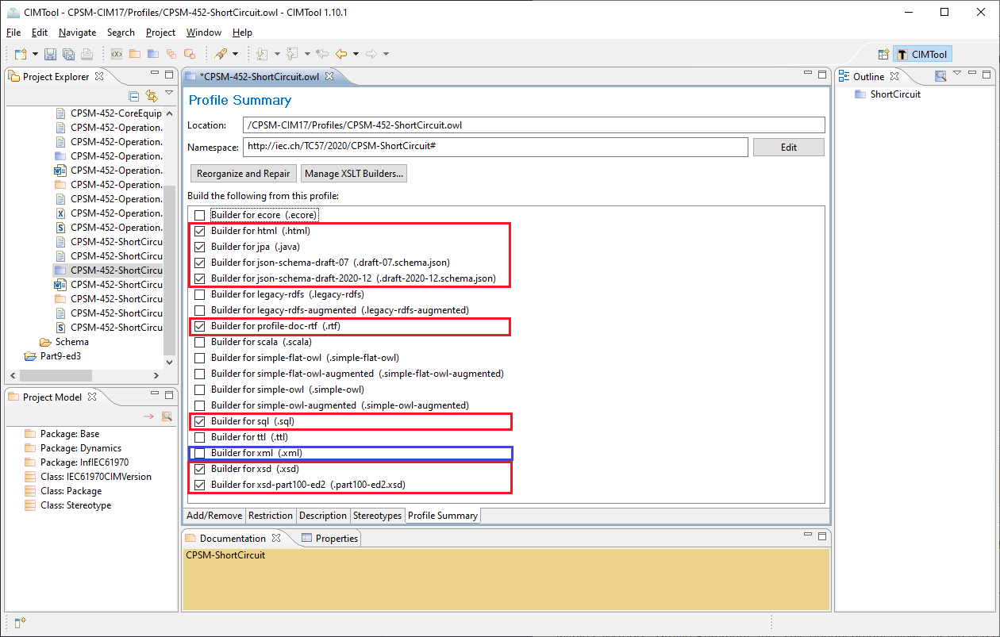

# CIMTool-XSLT-Builders
**CIMTool** supports a variety of different types of builders that generate artifacts based on a profile. Examples include XSD schemas, JPA Java source code, RDBMS DDL scripts, RDFS profiles, and RTF documentation builders amongst others.

Internally, **CIMTool** supports a category of builders based on XSLT transforms. In the screenshot below of CIMTool’s “Profile Summary” tab the builders that are selected are those which generate artifacts using XSLT transforms.  Starting with the **CIMTool.1.10.0.RC1** release, the ability to import custom user-defined XSLT transforms and add them to the list of builders was introduced.  The tables below illustrate access to these new screens.

This enhancement allows for the use of tools such as Altova’s XMLSpy to create and test XSLT 1.0 transforms and then import and manage them in CIMTool.

CIMug’s goal for this enhancement is to create a repository of custom XSLT transforms contributed by the community and, in turn, beneficial to the CIM community at large.

From the Select Import Wizards Screen... | ...Launches the Import XSLT Builder Screen
---------|---------
 | 

From the Profile Summary Tab... | ...Launches the Manage XSLT Transform Builders Screen
---------|---------
 |

Launch paths to the new UI screens (click on the images to present a larger view):
