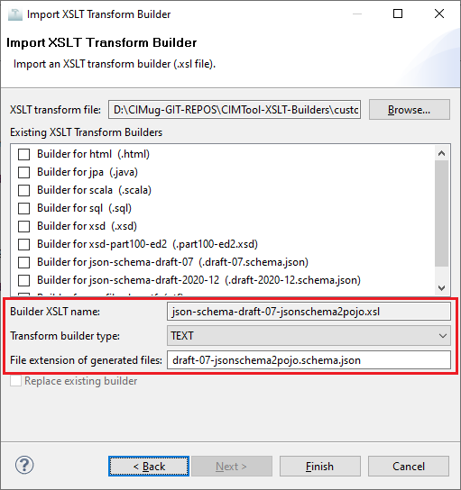

# json-schema-draft-07-jsonschema2pojo.xsl

A custom builder created on behalf of UCAIug. This is a community provided builder that does not ship with CIMTool.

## Builder Description

The **[json-schema-draft-07-jsonschema2pojo.xsl](json-schema-draft-07-jsonschema2pojo.xsl)** builder produces a specialized JSON schema to be used as input into the [jsonschema2pojo](https://www.jsonschema2pojo.org/) open source [Maven](https://maven.apache.org/) or [Gradle](https://gradle.org/) build plugins to generate annotated Java classes (i.e. [POJOs](https://en.wikipedia.org/wiki/Plain_old_Java_object)) for data-binding with [Jackson 2.x](https://github.com/FasterXML/jackson) or [Gson](https://github.com/google/gson). This custom builder was derived from the [json-schema-draft-07.xsl](../../shipped-builders/json-schema-draft-07/builder.md) builder and is intended to serve as a companion builder to it.

This builder produces JSON schemas used for generating code to exchange JSON payloads between systems with the latter's schemas used to validate those JSON payloads (typically on the receiving end). The schemas generated by this builder are not guaranteed to be valid JSON schema nor useful for validating instance data, rather they serve only for the purposes of Java code generation using jsonschema2pojo.  

Below is an example of a specialized JSON schema generated by this builder. The jsonschems2pojo ```javaType``` declaration at the root of the schema:

```JSON
"javaType": "org.ucaiug.substations.JsonSchema2Pojo"
```
...is included purely for the purposes of defining a top-level "root class" during jsonschema2pojo code generation. It serves to ensure that all subschemas (i.e. classes) defined in the ```definitions``` element of a schema are properly generated. This class should be deleted either manually or as part of the build script used to execute the jsonschema2pojo plugin to generate the Java code.

Note below the use of [extends](https://github.com/joelittlejohn/jsonschema2pojo/wiki/Reference#extends) for inheritance and jsonschema2pojo's [javaType](https://github.com/joelittlejohn/jsonschema2pojo/wiki/Reference#javatype) extension. For a complete overview of what is supported visit jsonschema2pojo's online [reference guide](https://github.com/joelittlejohn/jsonschema2pojo/wiki/Reference).


```JSON
{
     "$id": "http://ucaiug.org/2022/Substations.schema.json",
     "$schema": "http://json-schema.org/draft-07/schema#",
     "title": "Substations",
     "description": "",
     "namespace": "http://ucaiug.org/2022/Substations#",
     "type": "object",
     "javaType": "org.ucaiug.substations.JsonSchema2Pojo",
     "additionalProperties": false,
     "properties": {
         "Substations": {
              "$ref": "#/definitions/Substations"
         },
         "Breaker": {
             "$ref": "#/definitions/Breaker"
         },
         "ConductingEquipment": {
             "$ref": "#/definitions/ConductingEquipment"
         },
         "ConnectivityNodeContainer": {
             "$ref": "#/definitions/ConnectivityNodeContainer"
         },
         "Disconnector": {
             "$ref": "#/definitions/Disconnector"
         },
         "Equipment": {
             "$ref": "#/definitions/Equipment"
         },
         "EquipmentContainer": {
             "$ref": "#/definitions/EquipmentContainer"
         },
         "IdentifiedObject": {
             "$ref": "#/definitions/IdentifiedObject"
         },
         "PowerSystemResource": {
             "$ref": "#/definitions/PowerSystemResource"
         },
         "ProtectedSwitch": {
             "$ref": "#/definitions/ProtectedSwitch"
         },
         "Switch": {
             "$ref": "#/definitions/Switch"
         }
     },
     "required": [
         "Substation"
     ],
     "definitions": {
          "Substations": {
              "title": "Substations",
              "description": "Base type...",
              "javaType": "org.ucaiug.substations.Substations",
              "type": "object",
              "properties": {
                  "Substation": {
                      "type": "array",
                      "items": {
                          "$ref": "#/definitions/Substation"
                      },
                      "minItems": 1
                  }
              }
          },
          "Breaker": {
              "title": "Breaker",
              "description": "A mechanical switching device capable of making, carrying, and breaking currents under normal circuit conditions and also making, carrying for a specified time, and breaking currents under specified abnormal circuit conditions e.g. those of short circuit.",
              "modelReference": "http://iec.ch/TC57/CIM-generic#Breaker",
              "javaType": "org.ucaiug.substations.wires.Breaker",
              "extends": {
                  "$ref": "#/definitions/ProtectedSwitch"
              },
              "type": "object",
              "additionalProperties": false,
              "properties": {
                  "inTransitTime": {
                      "description": "The transition time from open to close.",
                      "modelReference": "http://iec.ch/TC57/CIM-generic#Breaker.inTransitTime",
                      "type": "number"
                  }
              },
              "required": [
                  "mRID", "aggregate", "inService", "breakingCapacity", "inTransitTime"
              ]
          },
          "ConductingEquipment": {
              "title": "ConductingEquipment",
              "description": "The parts of the AC power system that are designed to carry current or that are conductively connected through terminals.",
              "modelReference": "http://iec.ch/TC57/CIM-generic#ConductingEquipment",
              "javaType": "org.ucaiug.substations.core.ConductingEquipment",
              "extends": {
                  "$ref": "#/definitions/Equipment"
              },
              "type": "object",
              "additionalProperties": false,
              "properties": {
              },
              "required": [
                  "mRID", "aggregate", "inService"
              ]
          },
          "ConnectivityNodeContainer": {
              "title": "ConnectivityNodeContainer",
              "description": "A base class for all objects that may contain connectivity nodes or topological nodes.",
              "modelReference": "http://iec.ch/TC57/CIM-generic#ConnectivityNodeContainer",
              "javaType": "org.ucaiug.substations.core.ConnectivityNodeContainer",
              "extends": {
                  "$ref": "#/definitions/PowerSystemResource"
              },
              "type": "object",
              "additionalProperties": false,
              "properties": {
              },
              "required": [
                  "mRID"
              ]
          },
          "Disconnector": {
              "title": "Disconnector",
              "description": "A manually operated or motor operated mechanical switching device used for changing the connections in a circuit, or for isolating a circuit or equipment from a source of power. It is required to open or close circuits when negligible current is broken or made.",
              "modelReference": "http://iec.ch/TC57/CIM-generic#Disconnector",
              "javaType": "org.ucaiug.substations.wires.Disconnector",
              "extends": {
                  "$ref": "#/definitions/Switch"
              },
              "type": "object",
              "additionalProperties": false,
              "properties": {
              },
              "required": [
                  "mRID", "aggregate", "inService"
              ]
          },
          "Equipment": {
              "title": "Equipment",
              "description": "The parts of a power system that are physical devices, electronic or mechanical.",
              "modelReference": "http://iec.ch/TC57/CIM-generic#Equipment",
              "javaType": "org.ucaiug.substations.core.Equipment",
              "extends": {
                  "$ref": "#/definitions/PowerSystemResource"
              },
              "type": "object",
              "additionalProperties": false,
              "properties": {
                  "aggregate": {
                      "description": "The aggregate flag provides an alternative way of representing an aggregated (equivalent) element. It is applicable in cases when the dedicated classes for equivalent equipment do not have all of the attributes necessary to represent the required level of detail. In case the flag is set to “true� the single instance of equipment represents multiple pieces of equipment that have been modelled together as an aggregate equivalent obtained by a network reduction procedure. Examples would be power transformers or synchronous machines operating in parallel modelled as a single aggregate power transformer or aggregate synchronous machine. The attribute is not used for EquivalentBranch, EquivalentShunt and EquivalentInjection.",
                      "modelReference": "http://iec.ch/TC57/CIM-generic#Equipment.aggregate",
                      "type": "boolean"
                  },
                  "inService": {
                      "description": "Specifies the availability of the equipment. True means the equipment is available for topology processing, which determines if the equipment is energized or not. False means that the equipment is treated by network applications as if it is not in the model.",
                      "modelReference": "http://iec.ch/TC57/CIM-generic#Equipment.inService",
                      "type": "boolean"
                  }
              },
              "required": [
                  "mRID", "aggregate", "inService"
              ]
          },
          "EquipmentContainer": {
              "title": "EquipmentContainer",
              "description": "A modelling construct to provide a root class for containing equipment.",
              "modelReference": "http://iec.ch/TC57/CIM-generic#EquipmentContainer",
              "javaType": "org.ucaiug.substations.core.EquipmentContainer",
              "extends": {
                  "$ref": "#/definitions/ConnectivityNodeContainer"
              },
              "type": "object",
              "additionalProperties": false,
              "properties": {
                  "Equipments": {
                      "description": "Contained equipment.",
                      "modelReference": "http://iec.ch/TC57/CIM-generic#EquipmentContainer.Equipments",
                      "$comment": "Options for the choice corresponding to the 'Equipments' property.",
                      "type": "array",
                      "items": {
                          "$ref": "#/definitions/Equipment"
                      },
                      "minItems": 1
                  }
              },
              "required": [
                  "mRID", "Equipments"
              ]
          },
          "IdentifiedObject": {
              "title": "IdentifiedObject",
              "description": "This is a root class to provide common identification for all classes needing identification and naming attributes.",
              "modelReference": "http://iec.ch/TC57/CIM-generic#IdentifiedObject",
              "javaType": "org.ucaiug.substations.core.IdentifiedObject",
              "javaInterfaces": ["org.ucaiug.common.IdentifiedObjectTypeIF<NameType>"],
              "type": "object",
              "additionalProperties": false,
              "properties": {
                  "mRID": {
                      "description": "Master resource identifier issued by a model authority. The mRID is unique within an exchange context. Global uniqueness is easily achieved by using a UUID, as specified in RFC 4122, for the mRID. The use of UUID is strongly recommended. For CIMXML data files in RDF syntax conforming to IEC 61970-552, the mRID is mapped to rdf:ID or rdf:about attributes that identify CIM object elements.",
                      "modelReference": "http://iec.ch/TC57/CIM-generic#IdentifiedObject.mRID",
                      "type": "string"
                  },
                  "name": {
                      "description": "The name is any free human readable and possibly non unique text naming the object.",
                      "modelReference": "http://iec.ch/TC57/CIM-generic#IdentifiedObject.name",
                      "type": "string"
                  }
              },
              "required": [
                  "mRID"
              ]
          },
          "PowerSystemResource": {
              "title": "PowerSystemResource",
              "description": "A power system resource (PSR) can be an item of equipment such as a switch, an equipment container containing many individual items of equipment such as a substation, or an organisational entity such as sub-control area. Power system resources can have measurements associated.",
              "modelReference": "http://iec.ch/TC57/CIM-generic#PowerSystemResource",
              "javaType": "org.ucaiug.substations.core.PowerSystemResource",
              "extends": {
                  "$ref": "#/definitions/IdentifiedObject"
              },
              "type": "object",
              "additionalProperties": false,
              "properties": {
              },
              "required": [
                  "mRID"
              ]
          },
          "ProtectedSwitch": {
              "title": "ProtectedSwitch",
              "description": "A ProtectedSwitch is a switching device that can be operated by ProtectionEquipment.",
              "modelReference": "http://iec.ch/TC57/CIM-generic#ProtectedSwitch",
              "javaType": "org.ucaiug.substations.wires.ProtectedSwitch",
              "extends": {
                  "$ref": "#/definitions/Switch"
              },
              "type": "object",
              "additionalProperties": false,
              "properties": {
                  "breakingCapacity": {
                      "description": "The maximum fault current a breaking device can break safely under prescribed conditions of use.",
                      "modelReference": "http://iec.ch/TC57/CIM-generic#ProtectedSwitch.breakingCapacity",
                      "type": "number"
                  }
              },
              "required": [
                  "mRID", "aggregate", "inService", "breakingCapacity"
              ]
          },
          "Substation": {
              "title": "Substation",
              "description": "A collection of equipment for purposes other than generation or utilization, through which electric energy in bulk is passed for the purposes of switching or modifying its characteristics.",
              "modelReference": "http://iec.ch/TC57/CIM-generic#Substation",
              "javaType": "org.ucaiug.substations.core.Substation",
              "extends": {
                  "$ref": "#/definitions/EquipmentContainer"
              },
              "type": "object",
              "additionalProperties": false,
              "properties": {
              },
              "required": [
                  "mRID", "Equipments"
              ]
          },
          "Switch": {
              "title": "Switch",
              "description": "A generic device designed to close, or open, or both, one or more electric circuits. All switches are two terminal devices including grounding switches. The ACDCTerminal.connected at the two sides of the switch shall not be considered for assessing switch connectivity, i.e. only Switch.open, .normalOpen and .locked are relevant.",
              "modelReference": "http://iec.ch/TC57/CIM-generic#Switch",
              "javaType": "org.ucaiug.substations.wires.Switch",
              "extends": {
                  "$ref": "#/definitions/ConductingEquipment"
              },
              "type": "object",
              "additionalProperties": false,
              "properties": {
              },
              "required": [
                  "mRID", "aggregate", "inService"
              ]
          }
     }
}
```

## XSLT Version

This builder is XSLT 1.0 compliant.

## Author

Todd Viegut [@tviegut] on behalf of UCAIug.

## Submission Date

01-Sep-2022

## Builder NTE Configuration

The below screenshot highlights a suggested NTE (Name/Type/Extension) setting for the builder.  Minimally, the transform builder type must be declared as type **TEXT** in the dropdown.  However, the file extension may be specified per user preference (e.g. ```js2p.schema.json```).

>*NOTE: </br>CIMTool requires that file extensions be unique and will prevent you from entering an extension already assigned to a builder. This is because an artifact's name is derived by concatenating the base name of the CIMTool ```.owl``` profile with the file extension assigned to the builder. Therefore, a unique file extension must be assigned to each builder when imported. The file extension for a builder can be modified later from within the "Maintain XSLT Transform Builders" screen.*



## License

This builder is released under the [Apache 2.0](../../LICENSE) license and was developed under sponsorship of the UCAIug.
