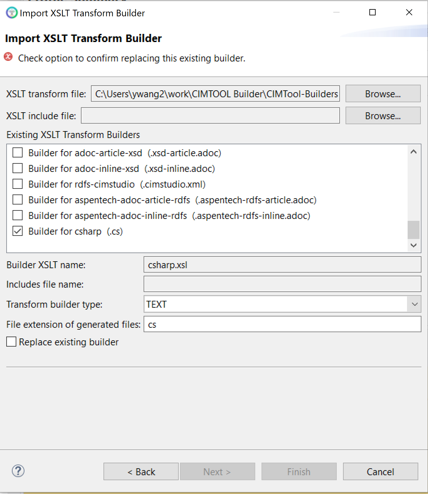

# {csharp.xml}

This builder is developing and might be shipped to CIMTOOL.

## Builder Description

The csharp.xsl builder generates a c# source file containing c# classes compatible with .Net.

It also created entity frameworks for each genereated classes.

Next is a sample extract of a generated c# source file containing entity frameworks classes:

```

using System;
using System.ComponentModel.DataAnnotations;
using System.ComponentModel.DataAnnotations.Schema;
using System.Collections.Generic;
/**
 * Annotated C# for Profile
 * Generated by CIMTool https://cimtool.ucaiug.io
 */
public class Profile
{
       [Table("DemandResponseProgram")]
       public class DemandResponseProgram : IdentifiedObject {
       // Inherits from IdentifiedObject - configure further in EF Fluent API if needed
           public DemandResponseProgram() { }
           
           public override string ToString() { return this.GetType().Name; }
           
           [Column("type")]
           public string Type { get; set; }
           [ForeignKey("validityInterval")]
           public virtual DateTimeInterval ValidityInterval { get; set; }
       }
       [Table("IdentifiedObject")]
       public class IdentifiedObject {
           public IdentifiedObject() { }
           
           public override string ToString() { return this.GetType().Name; }
           
       }
       [Table("Name")]
       public class Name {
           public Name() { }
           
           public override string ToString() { return this.GetType().Name; }
           
           [Column("name")]
           public string Name { get; set; }
           [ForeignKey("IdentifiedObject")]
           public virtual IdentifiedObject IdentifiedObject { get; set; }
           [ForeignKey("NameType")]
           public virtual NameType NameType { get; set; }
       }
       [Table("NameType")]
       public class NameType {
           public NameType() { }
           
           public override string ToString() { return this.GetType().Name; }
           
       }
        
       public static readonly System.Type[] allClasses = new System.Type[]
       {
           typeof(DemandResponseProgram),
           typeof(IdentifiedObject),
           typeof(Name),
           typeof(NameType)
       };
}


```

## XSLT Version

This builder is XSLT 1.0 compliant.

## Author

Yunshu Wang

## Submission Date

04/03/2025

## Builder NTE Configuration

Given this builder ships with CIMTool the below screenshot highlights the existing NTE (Name/Type/Extension) settings for the builder. We strongly recommend that you do not import customized versions of this shipped builder over the original in your local CIMTool installation. Doing so will force regeneration of any existing builder-generated artifacts for projects in your workspace that have this builder enabled.

The recommended best practice is to rename the builder file (from csharp.xsl to custom-csharp.xsl for example) before importing. On import this will be interpreted as a new builder and you will be allowed to enter values in the Type and Extension fields.

>*NOTE: </br>CIMTool requires that file extensions be unique and will prevent you from entering an extension already assigned to a builder. This is because an artifact's name is derived by concatenating the base name of the CIMTool ```.owl``` profile with the file extension assigned to the builder. Therefore, a unique file extension must be assigned to each builder when imported. The file extension for a builder can be modified later from within the "Maintain XSLT Transform Builders" screen.*



## License

This builder is released under the [Apache 2.0](../../LICENSE) license and was developed under sponsorship of the UCAIug.
