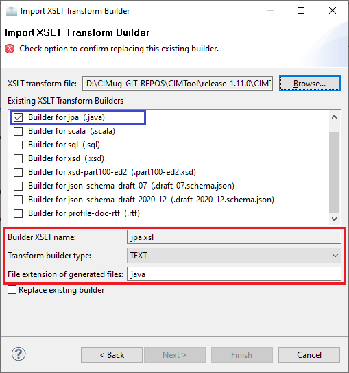

# jpa.xsl

This builder currently ships with CIMTool.

## Builder Description

The **[jpa.xsl](jpa.xsl)** builder generates a [Java](https://www.java.com/en/download/help/whatis_java.html) source file containing JPA classes compatible with JPA 2.2 and earlier.

What is JPA? The [Jakarta Persistence API](https://jcp.org/en/jsr/detail?id=338) (formerly Java Persistence API) is a Java specification that is concerned with persistence whereby, an application's key business objects are stored beyond the life of the process that created them. The JPA specification lets you define which objects should be persisted, and how they are persisted in Java applications. It was first released as a subset of the Enterprise JavaBeans 3.0 specification ([JSR 220](https://jcp.org/en/jsr/detail?id=220)) in Java EE 5. It has since evolved as its own specification starting with the release of JPA 2.0 in Java EE 6 ([JSR 317](https://jcp.org/en/jsr/detail?id=317)). JPA was adopted as an independent project of Jakarta EE in 2019. The current release is [JPA 3.1](https://projects.eclipse.org/projects/ee4j.jpa).

Popular JPA implementations include [Hibernate](https://hibernate.org/) and [EclipseLink](https://www.eclipse.org/eclipselink/).

Next is a sample extract of a generated Java source file containing JPA classes:

```java
package au.com.langdale.cimtool.generated;
import javax.persistence.*;
/**
 * Annotated java for GetUsagePointGroups
 * Generated by CIMTool http://cimtool.org
 */
public class GetUsagePointGroups
{
    /**
     * Demand response program.
     */
    @Entity
    @Table(name="DemandResponseProgram")
    @Inheritance(strategy=InheritanceType.JOINED)
    public static class DemandResponseProgram
    {
        public String getMRID () { return mRID; }
        public void setMRID ( String mRID ) { this.mRID = mRID; }
        @Id
        @Column(name="mRID")
        private String mRID ;

        /**
         * Type of demand response program; examples are CPP (critical-peak pricing),
         * RTP (real-time pricing), DLC (direct load control), DBP (demand bidding
         * program), BIP (base interruptible program). Note that possible types change
         * a lot and it would be impossible to enumerate them all.
         */
        public String getType () { return type; }
        public void setType ( String type ) { this.type = type; }
        @Basic(optional=true)
        @Column(name="type")
        private String type ;

    }
    /**
     * The Name class provides the means to define any number of human readable
     * names for an object. A name is <b>not</b> to be used for defining inter-object
     * relationships. For inter-object relationships instead use the object identification
     * 'mRID'.
     */
    @Entity
    @Table(name="Name")
    @Inheritance(strategy=InheritanceType.JOINED)
    public static class Name
    {
        public String getMRID () { return mRID; }
        public void setMRID ( String mRID ) { this.mRID = mRID; }
        @Id
        @Column(name="mRID")
        private String mRID ;

        /**
         * Any free text that name the object.
         */
        public String getName () { return name; }
        public void setName ( String name ) { this.name = name; }
        @Basic()
        @Column(name="name")
        private String name ;

        /**
         * Type of this name.
         */
        public NameType getNameType () { return nameType; }
        public void setNameType ( NameType nameType ) { this.nameType = nameType; }
        @ManyToOne(fetch=FetchType.LAZY, optional=true)
        @JoinColumn(name="NameType")
        private NameType nameType ;

    }
    /**
     * Type of name. Possible values for attribute 'name' are implementation dependent
     * but standard profiles may specify types. An enterprise may have multiple
     * IT systems each having its own local name for the same object, e.g. a planning
     * system may have different names from an EMS. An object may also have different
     * names within the same IT system, e.g. localName as defined in CIM version
     * 14. The definition from CIM14 is:
     * The localName is a human readable name of the object. It is a free text
     * name local to a node in a naming hierarchy similar to a file directory
     * structure. A power system related naming hierarchy may be: Substation,
     * VoltageLevel, Equipment etc. Children of the same parent in such a hierarchy
     * have names that typically are unique among them.
     */
    @Entity
    @Table(name="NameType")
    @Inheritance(strategy=InheritanceType.JOINED)
    public static class NameType
    {
        public String getMRID () { return mRID; }
        public void setMRID ( String mRID ) { this.mRID = mRID; }
        @Id
        @Column(name="mRID")
        private String mRID ;

        /**
         * Description of the name type.
         */
        public String getDescription () { return description; }
        public void setDescription ( String description ) { this.description = description; }
        @Basic(optional=true)
        @Column(name="description")
        private String description ;

        /**
         * Name of the name type.
         */
        public String getName () { return name; }
        public void setName ( String name ) { this.name = name; }
        @Basic()
        @Column(name="name")
        private String name ;

        /**
         * Authority responsible for managing names of this type.
         */
        public NameTypeAuthority getNameTypeAuthority () { return nameTypeAuthority; }
        public void setNameTypeAuthority ( NameTypeAuthority nameTypeAuthority ) { this.nameTypeAuthority = nameTypeAuthority; }
        @ManyToOne(fetch=FetchType.LAZY, optional=true)
        @JoinColumn(name="NameTypeAuthority")
        private NameTypeAuthority nameTypeAuthority ;

    }
    /**
     * Authority responsible for creation and management of names of a given type;
     * typically an organization or an enterprise system.
     */
    @Entity
    @Table(name="NameTypeAuthority")
    @Inheritance(strategy=InheritanceType.JOINED)
    public static class NameTypeAuthority
    {
        public String getMRID () { return mRID; }
        public void setMRID ( String mRID ) { this.mRID = mRID; }
        @Id
        @Column(name="mRID")
        private String mRID ;

        /**
         * Description of the name type authority.
         */
        public String getDescription () { return description; }
        public void setDescription ( String description ) { this.description = description; }
        @Basic(optional=true)
        @Column(name="description")
        private String description ;

        /**
         * Name of the name type authority.
         */
        public String getName () { return name; }
        public void setName ( String name ) { this.name = name; }
        @Basic()
        @Column(name="name")
        private String name ;

    }
    /**
     * Logical or physical point in the network to which readings or events may
     * be attributed. Used at the place where a physical or virtual meter may
     * be located; however, it is not required that a meter be present.
     */
    @Entity
    @Table(name="UsagePoint")
    @Inheritance(strategy=InheritanceType.JOINED)
    public static class UsagePoint
    {
        public String getMRID () { return mRID; }
        public void setMRID ( String mRID ) { this.mRID = mRID; }
        @Id
        @Column(name="mRID")
        private String mRID ;

    }
    /**
     * Abstraction for management of group communications within a two-way AMR
     * system or the data for a group of related usage points. Commands can be
     * issued to all of the usage points that belong to a usage point group using
     * a defined group address and the underlying AMR communication infrastructure.
     */
    @Entity
    @Table(name="UsagePointGroup")
    @Inheritance(strategy=InheritanceType.JOINED)
    public static class UsagePointGroup
    {
        public String getMRID () { return mRID; }
        public void setMRID ( String mRID ) { this.mRID = mRID; }
        @Id
        @Column(name="mRID")
        private String mRID ;

    }

    public static final Class[] allClasses = new Class[]
    {
        DemandResponseProgram.class,
        Name.class,
        NameType.class,
        NameTypeAuthority.class,
        UsagePoint.class,
        UsagePointGroup.class
    };
}
```

## XSLT Version

This builder is XSLT 1.0 compliant.

## Author

Arnold deVos on behalf of UCAIug.

## Submission Date

12-May-2009

## Builder NTE Configuration

Given this builder ships with CIMTool the below screenshot highlights the existing NTE (Name/Type/Extension) settings for the builder.  We strongly recommend that you do not import customized versions of this shipped builder over the original in your local CIMTool installation. Doing so will force regeneration of any existing builder-generated artifacts for projects in your workspace that have this builder enabled.

The recommended best practice is to rename the builder file  (from ```jpa.xsl``` to ```custom-jpa.xsl``` for example) before importing. On import this will be interpreted as a new builder and you will be allowed to enter values in the Type and Extension fields.

>*NOTE: </br>CIMTool requires that file extensions be unique and will prevent you from entering an extension already assigned to a builder. This is because an artifact's name is derived by concatenating the base name of the CIMTool ```.owl``` profile with the file extension assigned to the builder. Therefore, a unique file extension must be assigned to each builder when imported. The file extension for a builder can be modified later from with the "Maintain XSLT Transform Builders" screen.*



## License

This builder is released under the [Apache 2.0](../../LICENSE) license and was developed under sponsorship of the UCAIug.
