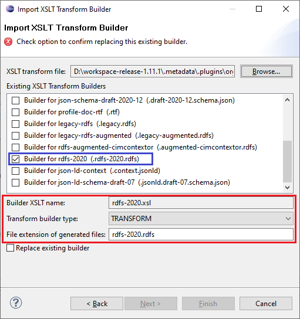

# rdfs-2020.xsl

This builder currently ships with CIMTool.

## Builder Description

Though not currently published as a formal standard, there has been "de facto agreements" on additional extensions to those defined in the [IEC 61970-501:2006 "Common Information Model Resource Description Framework (CIM RDF) schema"](https://webstore.iec.ch/publication/6215) published standard. These additional extensions were added in order to better support representation of the semantics needed for CIM RDFS profiles. Introduced after the publication of the [IEC 61970-501:2006](https://webstore.iec.ch/publication/6215), this latest RDFS schema format is commonly referred to as **RDFS2020** and is in use by ENTSO-E CGMES and supported in both **CimConteXtor/CimSyntaxGen** and **CIMTool** profiling tools. 

This **[rdfs-2020.xsl](rdfs-2020.xsl)** builder generates RDFS2020 compliant schemas that include the following:

1. The ```xml:lang``` attribute now appears on ```rds:label```-s to indicate the locale language associated with the text:

    ```xml 
    <rdfs:label xml:lang="en">ACDCConverterDCTerminal</rdfs:label>
    ```

2. The ```rdf:datatype``` attribute hnow appears on ```rdfs:comment``` elements:

    ```xml
    <rdfs:comment rdf:datatype="http://www.w3.org/2001/XMLSchema#string">The attribute is used for an exchange of the EIC code (Energy identification Code). The length of the string is 16 characters as defined by the EIC code. For details on EIC scheme please refer to ENTSO-E web site.</rdfs:comment>
    ```

3. In generated profile output all stereotypes now use the "http://iec.ch/TC57/NonStandard/UML" namespace:

    ```xml
    <cims:stereotype rdf:resource="http://iec.ch/TC57/NonStandard/UML#concrete" />
    ```
4. A new **Description** stereotype that, when present, indicates that an ```rdf:about``` (as opposed to an ```rdf:ID```) should be used as the type of RDF identifier within serialized instance files:

    ```xml
   <rdf:Description rdf:about="#VsConverter">
      <cims:belongsToCategory rdf:resource="#Package_DC"/>
      <cims:stereotype rdf:resource="http://iec.ch/TC57/NonStandard/UML#concrete"/>
      <!-- Description stereotype indicating that for RDF instance data an rdf:about rdf 'global 'identifier is used -->
      <cims:stereotype>Description</cims:stereotype>
      <rdf:type rdf:resource="http://www.w3.org/2000/01/rdf-schema#Class"/>
      <rdfs:comment rdf:datatype="http://www.w3.org/2001/XMLSchema#string">DC side of the voltage source converter (VSC).</rdfs:comment>
      <rdfs:label xml:lang="en">VsConverter</rdfs:label>
      <rdfs:subClassOf rdf:resource="#ACDCConverter"/>
   </rdf:Description>
    ```

5. The **attribute** stereotype is output for all attributes (i.e. not associations) appearing in generated RDFS2020 profiles.  For example:

    ```xml
    <rdf:Description rdf:about="#IdentifiedObject.description">
        <!-- Here the "http://iec.ch/TC57/NonStandard/UML#attribute" expressly declares the description as an attribute. -->
        <cims:stereotype rdf:resource="http://iec.ch/TC57/NonStandard/UML#attribute"/>
        <rdfs:label xml:lang="en">description</rdfs:label>
        <rdfs:domain rdf:resource="#IdentifiedObject"/>
        <cims:dataType rdf:resource="#String"/>
        <cims:multiplicity rdf:resource="http://iec.ch/TC57/1999/rdf-schema-extensions-19990926#M:0..1"/>
        <rdfs:comment rdf:datatype="http://www.w3.org/2001/XMLSchema#string">The description is a free human readable text describing or naming the object. It may be non unique and may not correlate to a naming hierarchy.</rdfs:comment>
        <rdf:type rdf:resource="http://www.w3.org/1999/02/22-rdf-syntax-ns#Property"/>
    </rdf:Description>
    ```

6. New ```<cims:AssociationUsed>Yes</cims:AssociationUsed>``` and ```<cims:AssociationUsed>No</cims:AssociationUsed>``` elements that indicate which end of an association is used in the profile. For example:

    ```xml
    <rdf:Description rdf:about="#ACDCConverterDCTerminal.DCConductingEquipment">
        <rdfs:label xml:lang="en">DCConductingEquipment</rdfs:label>
        <rdfs:comment rdf:datatype="http://www.w3.org/2001/XMLSchema#string">A DC converter terminal belong to an DC converter.</rdfs:comment>
        <rdfs:domain rdf:resource="#ACDCConverterDCTerminal"/>
        <rdfs:range rdf:resource="#ACDCConverter"/>
        <cims:inverseRoleName rdf:resource="#ACDCConverter.DCTerminals"/>
        <cims:multiplicity rdf:resource="http://iec.ch/TC57/1999/rdf-schema-extensions-19990926#M:1"/>
        <!-- Here the AssociationUsed element indicates that this side of the association is what will appear in the instance data. -->
        <cims:AssociationUsed>Yes</cims:AssociationUsed>
        <rdf:type rdf:resource="http://www.w3.org/1999/02/22-rdf-syntax-ns#Property"/>
    </rdf:Description>

    <rdf:Description rdf:about="#ACDCConverter.DCTerminals">
        <rdfs:label xml:lang="en">DCTerminals</rdfs:label>
        <rdfs:comment rdf:datatype="http://www.w3.org/2001/XMLSchema#string">A DC converter have DC converter terminals. A converter has two DC converter terminals.</rdfs:comment>
        <rdfs:domain rdf:resource="#ACDCConverter"/>
        <rdfs:range rdf:resource="#ACDCConverterDCTerminal"/>
        <cims:inverseRoleName rdf:resource="#ACDCConverterDCTerminal.DCConductingEquipment"/>
        <cims:multiplicity rdf:resource="http://iec.ch/TC57/1999/rdf-schema-extensions-19990926#M:0..n"/>
        <!-- Here the AssociationUsed element indicates that this side of the association is what will not appear in the profile instance data. However, having it present is criticial for graph DBs and other inferencing that may have need to navigate the relationship from the other direction. -->
        <cims:AssociationUsed>No</cims:AssociationUsed>
        <rdf:type rdf:resource="http://www.w3.org/1999/02/22-rdf-syntax-ns#Property"/>
    </rdf:Description>
    ```


## XSLT Version

This builder is XSLT 3.0 compliant.

## Author

Todd Viegut [@tviegut] on behalf of UCAIug.

## Submission Date

21-Feb-2024

## Builder NTE Configuration

Given this builder ships with CIMTool the below screenshot highlights the existing NTE (Name/Type/Extension) settings for the builder.  We strongly recommend that you do not import customized versions of this shipped builder over the original in your local CIMTool installation. Doing so will force regeneration of any existing builder-generated artifacts for projects in your workspace that have this builder enabled.

The recommended best practice is to rename the builder file  (from ```rdfs-2020.xsl``` to ```custom-rdfs-2020.xsl``` for example) before importing. On import this will be interpreted as a new builder and you will be allowed to enter values in the Type and Extension fields.

>*NOTE: </br>CIMTool requires that file extensions be unique and will prevent you from entering an extension already assigned to a builder. This is because an artifact's name is derived by concatenating the base name of the CIMTool ```.owl``` profile with the file extension assigned to the builder. Therefore, a unique file extension must be assigned to each builder when imported. The file extension for a builder can be modified later from within the "Maintain XSLT Transform Builders" screen.*



## License

This builder is released under the [Apache 2.0](../../LICENSE) license and was developed under sponsorship of the UCAIug.
