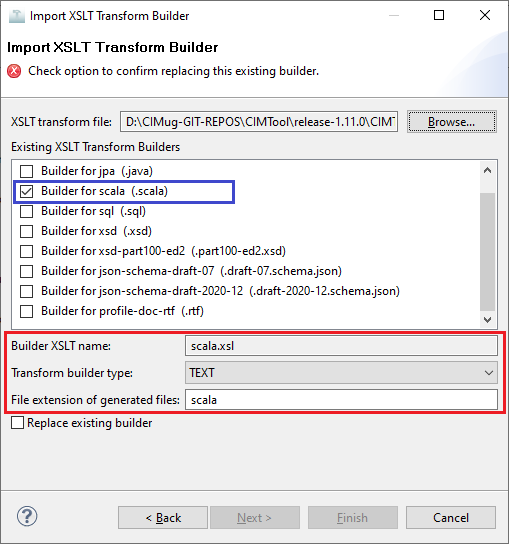

# scala.xsl

This builder currently ships with CIMTool.

## Builder Description

The **scala.xsl** builder generates a [Scala](https://en.wikipedia.org/wiki/Scala_(programming_language)) source file that defines a vocabulary corresponding to the profile.

Per the wikipedia entry for Scala:

>*Scala is a strong statically typed general-purpose programming language which supports both object-oriented programming and functional programming. Designed to be concise, many of Scala's design decisions are aimed to address criticisms of Java.</br>Scala source code can be compiled to Java bytecode and run on a Java virtual machine (JVM). Scala can also be compiled to JavaScript to run in a browser, or directly to a native executable. On the JVM Scala provides language interoperability with Java so that libraries written in either language may be referenced directly in Scala or Java code. Like Java, Scala is object-oriented, and uses a syntax termed curly-brace which is similar to the language C.*

A sample extract of a generated Scala source file is illustrated next:

``` Scala
package au.com.langdale.skena.vocabulary;
import au.com.langdale.skena._
/**
 * API for GetUsagePointGroups
 * Generated by CIMTool http://cimtool.org
 */
object `GetUsagePointGroups` extends Vocabulary
{
    /**
     * Demand response program.
     */
    object `DemandResponseProgram` extends Class( "DemandResponseProgram", "http://iec.ch/TC57/CIM-generic#DemandResponseProgram" )
    {
        /**
         * Master resource identifier issued by a model authority. The mRID is unique
         * within an exchange context. Global uniqueness is easily achieved by using
         * a UUID, as specified in RFC 4122, for the mRID. The use of UUID is strongly
         * recommended.
         * For CIMXML data files in RDF syntax conforming to IEC 61970-552, the mRID
         * is mapped to rdf:ID or rdf:about attributes that identify CIM object elements.
         */
        object `mRID` extends FunctionalDataProperty[String]( "mRID", "http://iec.ch/TC57/CIM-generic#IdentifiedObject.mRID", "string" )
        /**
         * Type of demand response program; examples are CPP (critical-peak pricing),
         * RTP (real-time pricing), DLC (direct load control), DBP (demand bidding
         * program), BIP (base interruptible program). Note that possible types change
         * a lot and it would be impossible to enumerate them all.
         */
        object `type` extends FunctionalDataProperty[String]( "type", "http://iec.ch/TC57/CIM-generic#DemandResponseProgram.type", "string" )
        /**
         * All names of this identified object.
         */
        object `Names` extends ObjectProperty( "Names", "http://iec.ch/TC57/CIM-generic#IdentifiedObject.Names" )
    }
    /**
     * The Name class provides the means to define any number of human readable
     * names for an object. A name is <b>not</b> to be used for defining inter-object
     * relationships. For inter-object relationships instead use the object identification
     * 'mRID'.
     */
    object `Name` extends Class( "Name", "http://iec.ch/TC57/CIM-generic#Name" )
    {
        /**
         * Any free text that name the object.
         */
        object `name` extends FunctionalDataProperty[String]( "name", "http://iec.ch/TC57/CIM-generic#Name.name", "string" )
        /**
         * Type of this name.
         */
        object `NameType` extends FunctionalObjectProperty( "NameType", "http://iec.ch/TC57/CIM-generic#Name.NameType" )
    }
    /**
     * Type of name. Possible values for attribute 'name' are implementation dependent
     * but standard profiles may specify types. An enterprise may have multiple
     * IT systems each having its own local name for the same object, e.g. a planning
     * system may have different names from an EMS. An object may also have different
     * names within the same IT system, e.g. localName as defined in CIM version
     * 14. The definition from CIM14 is:
     * The localName is a human readable name of the object. It is a free text
     * name local to a node in a naming hierarchy similar to a file directory
     * structure. A power system related naming hierarchy may be: Substation,
     * VoltageLevel, Equipment etc. Children of the same parent in such a hierarchy
     * have names that typically are unique among them.
     */
    object `NameType` extends Class( "NameType", "http://iec.ch/TC57/CIM-generic#NameType" )
    {
        /**
         * Description of the name type.
         */
        object `description` extends FunctionalDataProperty[String]( "description", "http://iec.ch/TC57/CIM-generic#NameType.description", "string" )
        /**
         * Name of the name type.
         */
        object `name` extends FunctionalDataProperty[String]( "name", "http://iec.ch/TC57/CIM-generic#NameType.name", "string" )
        /**
         * Authority responsible for managing names of this type.
         */
        object `NameTypeAuthority` extends FunctionalObjectProperty( "NameTypeAuthority", "http://iec.ch/TC57/CIM-generic#NameType.NameTypeAuthority" )
    }
    /**
     * Authority responsible for creation and management of names of a given type;
     * typically an organization or an enterprise system.
     */
    object `NameTypeAuthority` extends Class( "NameTypeAuthority", "http://iec.ch/TC57/CIM-generic#NameTypeAuthority" )
    {
        /**
         * Description of the name type authority.
         */
        object `description` extends FunctionalDataProperty[String]( "description", "http://iec.ch/TC57/CIM-generic#NameTypeAuthority.description", "string" )
        /**
         * Name of the name type authority.
         */
        object `name` extends FunctionalDataProperty[String]( "name", "http://iec.ch/TC57/CIM-generic#NameTypeAuthority.name", "string" )
    }
    /**
     * Logical or physical point in the network to which readings or events may
     * be attributed. Used at the place where a physical or virtual meter may
     * be located; however, it is not required that a meter be present.
     */
    object `UsagePoint` extends Class( "UsagePoint", "http://iec.ch/TC57/CIM-generic#UsagePoint" )
    {
        /**
         * Master resource identifier issued by a model authority. The mRID is unique
         * within an exchange context. Global uniqueness is easily achieved by using
         * a UUID, as specified in RFC 4122, for the mRID. The use of UUID is strongly
         * recommended.
         * For CIMXML data files in RDF syntax conforming to IEC 61970-552, the mRID
         * is mapped to rdf:ID or rdf:about attributes that identify CIM object elements.
         */
        object `mRID` extends FunctionalDataProperty[String]( "mRID", "http://iec.ch/TC57/CIM-generic#IdentifiedObject.mRID", "string" )
        /**
         * All names of this identified object.
         */
        object `Names` extends ObjectProperty( "Names", "http://iec.ch/TC57/CIM-generic#IdentifiedObject.Names" )
    }
    /**
     * Abstraction for management of group communications within a two-way AMR
     * system or the data for a group of related usage points. Commands can be
     * issued to all of the usage points that belong to a usage point group using
     * a defined group address and the underlying AMR communication infrastructure.
     */
    object `UsagePointGroup` extends Class( "UsagePointGroup", "http://iec.ch/TC57/CIM-generic#UsagePointGroup" )
    {
        /**
         * Master resource identifier issued by a model authority. The mRID is unique
         * within an exchange context. Global uniqueness is easily achieved by using
         * a UUID, as specified in RFC 4122, for the mRID. The use of UUID is strongly
         * recommended.
         * For CIMXML data files in RDF syntax conforming to IEC 61970-552, the mRID
         * is mapped to rdf:ID or rdf:about attributes that identify CIM object elements.
         */
        object `mRID` extends FunctionalDataProperty[String]( "mRID", "http://iec.ch/TC57/CIM-generic#IdentifiedObject.mRID", "string" )
        /**
         * All names of this identified object.
         */
        object `Names` extends ObjectProperty( "Names", "http://iec.ch/TC57/CIM-generic#IdentifiedObject.Names" )
    }
}

```

## XSLT Version

This builder is XSLT 1.0 compliant.

## Author

Arnold deVos on behalf of UCAIug.

## Submission Date

21-Jan-2009

## Builder NTE Configuration

Given this builder ships with CIMTool the below screenshot highlights the existing NTE (Name/Type/Extension) settings for the builder.  We strongly recommend that you do not import customized versions of this shipped builder over the original in your local CIMTool installation. Doing so will force regeneration of any existing builder-generated artifacts for projects in your workspace that have this builder enabled.

The recommended best practice is to rename the builder file  (from ```sql.xsl``` to ```custom-sql.xsl``` for example) before importing. On import this will be interpreted as a new builder and you will be allowed to enter values in the Type and Extension fields.

>*NOTE: </br>CIMTool requires that file extensions be unique and will prevent you from entering an extension already assigned to a builder. This is because an artifact's name is derived by concatenating the base name of the CIMTool ```.owl``` profile with the file extension assigned to the builder. Therefore, a unique file extension must be assigned to each builder when imported. The file extension for a builder can be modified later from with the "Maintain XSLT Transform Builders" screen.*



## License

This builder is released under the [Apache 2.0](../../LICENSE) license and was developed under sponsorship of the UCAIug.
