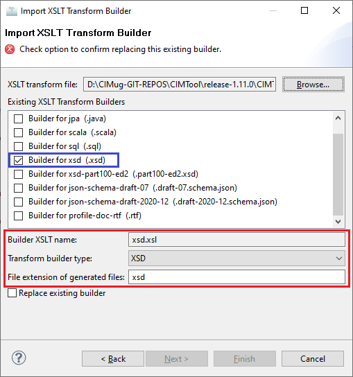

# xsd.xsl

This builder currently ships with CIMTool.

## Builder Description

The **xsd.xsl** builder generates an XSD schema that is compliant with the [IEC 62361-100:2016 "CIM Profiles to XML Schema Mapping"](https://webstore.iec.ch/publication/25114) published standard.  The **IEC 62361-100:2016** standard describes a mapping from CIM profiles to [W3C XML Schemas](https://www.w3.org/TR/xmlschema11-1/), intended to facilitate the exchange of information in the form of XML documents whose semantics are defined by the IEC CIM and whose syntax is defined by a W3C XML schema.

Additionally, the XSD schemas generated by this builder are fully compatible with the [IEC 61968-100:2013 "Implementation Profiles" Ed 1.0](https://webstore.iec.ch/publication/6198) published standard. This standard provides the implementation profiles for enterprise integration using common integration technologies, including JMS and web services. It provides guidance with respect to the use of Enterprise Service Bus (ESB) technologies and a means to derive interoperable implementations of IEC 61968-3 to IEC 61968-9 Component Interface Specification standards. At the same time, Part 100 can be leveraged beyond information exchanges defined by IEC 61968, such as for the integration of market systems or general enterprise integration.

For a builder that generates XSD schemas compatible with [IEC 61968-100 Ed 2.0](https://webstore.iec.ch/publication/67766) visit the entry for the [xsd-part100-ed2.xsl](../xsd-part100.ed2/builder.md) builder.

## XSLT Version

This builder is XSLT 1.0 compliant.

## Author

Arnold deVos on behalf of UCAIug.

## Submission Date

29-May-2008

## Import Configuration

Given this builder ships with CIMTool the below screenshot highlights the existing NTE (Name/Type/Extension) settings for the builder.  We strongly recommend that you do not import customized versions of this shipped builder over the original in your local CIMTool installation. Doing so will force regeneration of any existing builder-generated artifacts for projects in your workspace that have this builder enabled.

The recommended best practice is to rename both the ```.xsl``` builder file  (from ```xsd.xsl``` to ```custom-xsd.xsl``` for example) before importing. On import this will be interpreted as a new builder and you will be allowed to enter values in the Type and Extension fields.

>*NOTE: </br>CIMTool requires that file extensions be unique and will prevent you from entering an extension already assigned to a builder. This is because an artifact's name is derived by concatenating the base name of the CIMTool ```.owl``` profile with the file extension assigned to the builder. Therefore, a unique file extension must be assigned to each builder when imported. The file extension for a builder can be modified later from with the "Maintain XSLT Transform Builders" screen.*



## License

This builder is released under the [Apache 2.0](/../LICENSE) license and was developed under sponsorship of the UCAIug.
